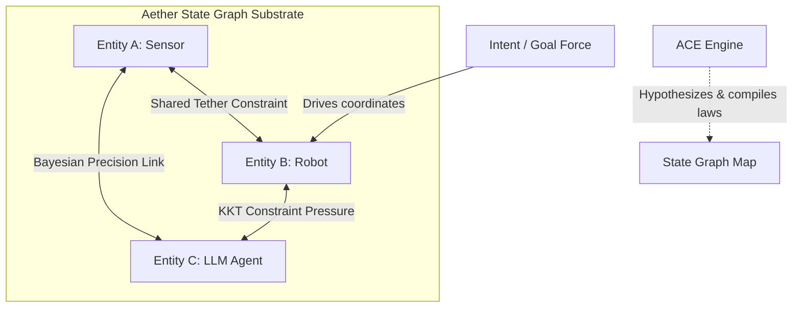

# Aether: The Operating System for Stateful Intelligence

> **Introducing State Computing — a new paradigm for continuous, stateful, and constrained intelligent systems, powered by the Aether Runtime.**
>
> *Note: The underlying codebase modules remain located in the `RealityOS/` folder, representing the core kernel of the Aether platform.*

---

## 1. The Philosophy of Aether

In classical physics, **Aether** was hypothesized as the invisible, active medium through which light waves and electromagnetic forces propagate. 

In **State Computing**, **Aether** is the active computational medium through which state interactions, intents, and constraint pressures propagate. Instead of isolating models in stateless sandboxes, Aether embeds all entities into a continuous, evolving **State Graph** governed by KKT Primal-Dual mechanics.



### 1.1 The Shift: Stateful Intelligence vs. Stateless APIs

| Dimension | Stateless Model (Transformers / LLMs) | State Computing (Aether Substrate) |
| :--- | :--- | :--- |
| **Operational Primitive** | Raw Input/Output Tokens (serialization). | **State Object** (coordinates, velocities, constraints). |
| **Memory** | Detached vector databases or context windows. | Stable **Attractor Basins** carved into the geometry. |
| **Reasoning** | Autoregressive sequence generation. | State evolution under KKT variational constraints. |
| **System Scheduling** | Static cron/requests (always running). | **Intrinsic local time** $dt$ scaling with surprise. |
| **Defensibility Moat** | Model weights (easily commoditized). | Evolving **State Graph** mesh of interconnected systems. |

---

## 2. Core Architecture & Component Breakdown

Aether is structured into the **Aether Runtime** (the core substrate), the **ACE Engine** (the constraint compiler), and the **CAMP Observatory** (the inspection application).

```
project-R/
├── RealityOS/                     # Core Aether Runtime Modules
│   ├── kernel/
│   │   ├── relational_engine.py   # Primal-Dual KKT solver & Operator algebra
│   │   └── ace_engine.py          # Adaptive Constraint Evolution (ACE) engine
│   ├── fabric/                    # Scheduler, fabric events, and energy management
│   ├── demos/
│   │   └── demo_state_computing.py# Developer SDK usage demonstration
│   └── sdk.py                     # High-level Aether Developer SDK wrapper
│
├── camp/                          # Product Application Layer (CAMP Observatory)
│   ├── core/
│   │   ├── agent_watcher.py       # Observability engine mapping metrics to states
│   │   ├── alert_engine.py        # Value-weighted priority alert generator
│   │   └── self_model.py          # Watcher self-health monitoring
│   ├── api/                       # FastAPI backend (WebSocket + REST)
│   └── dashboard/                 # Glassmorphic real-time UI
│
├── pyproject.toml                 # PEP-517 package configuration
└── build_package.py               # Compilation and packaging script
```

---

## 3. How It Works (Under the Hood)

### 3.1 Relational-Action Calculus
The coordinate space $G$ evolves to minimize the scalar **Relational Action**:
$$\mathcal{R}[G] = \int_0^T \left[ D_{KL}(P_{\text{post}}(\Delta G \mid G) \parallel P_{\text{prior}}(\Delta G \mid G)) + \sum_\alpha \Lambda_\alpha C_\alpha(\Delta G)^2 \right] dt$$

At each step, Aether runs a **KKT Primal-Dual optimization loop** in [relational_engine.py](file:///c:/Users/namir/Downloads/project r/project-R/RealityOS/kernel/relational_engine.py):
1.  **Primal Update (State Correction):** Shifts coordinates along the gradient of the Lagrangian:
    $$G \leftarrow G - \eta_{\text{adaptive}} \nabla_G \mathcal{L}$$
    where $\mathcal{L} = \text{Surprise} + \sum_\alpha \Lambda_\alpha C_\alpha(G)^2$. The learning rate $\eta_{\text{adaptive}}$ scales dynamically with active violation stress to speed up convergence under stress.
2.  **Dual Update (Constraint Pressure accumulation):** Ascends Lagrange multipliers based on constraint violations:
    $$\Lambda_\alpha \leftarrow \max(0, \Lambda_\alpha + \alpha_{\text{dual}} C_\alpha(G)^2)$$
    These dual multipliers ($\Lambda$) represent the **shadow prices** of the constraints.

### 3.2 Adaptive Constraint Evolution (ACE)
Instead of relying on statically defined rules, the **ACE Engine** in [ace_engine.py](file:///c:/Users/namir/Downloads/project r/project-R/RealityOS/kernel/ace_engine.py) acts as a passive scientific compiler:
1.  **Hypothesize:** Scans historical trajectories to find invariant templates (pairwise distance, radial orbits, coordinate locks).
2.  **Score & Promote:** Evaluates candidates. If the violation variance is low and score exceeds a threshold ($\ge 0.8$), it promotes the candidate to an `active` constraint.
3.  **Consistency Check:** Verifies new candidates don't conflict with existing active constraints to maintain gradient stability.
4.  **Retire:** If an active constraint is refuted (exceeds violation limits) or becomes redundant (pressure $\Lambda \rightarrow 0$), it is retired.

---

## 4. Developer SDK Quickstart

Here is how developers interact with the Aether State Computing SDK in [sdk.py](file:///c:/Users/namir/Downloads/project r/project-R/RealityOS/sdk.py):

```python
from RealityOS import State, Universe

# 1. Initialize the state space (Universe)
universe = Universe(eta=0.08, alpha_dual=0.1)

# 2. Create state objects using the factory method
drone_1 = universe.create_state(name="drone_1", dim=2)
drone_2 = universe.create_state(name="drone_2", dim=2)

drone_1.coords = [0.0, 0.0]
drone_2.coords = [2.0, 0.0]
universe.initialize()

# 3. Apply a continuous tether constraint (distance limit = 2.5)
def tether_constraint(G):
    import math
    dist = math.sqrt((G[0][0] - G[1][0])**2 + (G[0][1] - G[1][1])**2)
    return dist - 2.5

universe.apply_constraint("tether", tether_constraint)

# 4. Apply intent goals and step the timeline
drone_2.goal([1.0, 0.0])  # Push drone_2 in +X
universe.step()

# 5. Introspection & Counterfactual Simulation
# Predict future coordinates on a branched timeline without affecting active states
future_trajectory = universe.simulate(steps=5)

# 6. Time-travel rollback & counterfactual intervention
universe.rewind(ticks=1)  # Rollback 1 step in history
drone_1.intervene([-0.5, 0.5])  # Inject external impulse force
```

---

## 5. Scientific Roadmap: Phased Evolution

Aether's capabilities are designed to scale through successive scientific phases:

```
┌──────────────────────────────────────────────────────────────┐
│ Phase 1: Adaptive Constraint Evolution (ACE)                 │
│ The system invents, scores, and retires constraints.         │
└──────────────────────────────┬───────────────────────────────┘
                               │
┌──────────────────────────────▼───────────────────────────────┐
│ Phase 2: Constraint Graph & Ecology                          │
│ Constraints cooperate, compete, and propagate pressure.      │
└──────────────────────────────┬───────────────────────────────┘
                               │
┌──────────────────────────────▼───────────────────────────────┐
│ Phase 3: Attractor Memory                                    │
│ Experience reshapes the geometry of the energy landscape.   │
└──────────────────────────────┬───────────────────────────────┘
                               │
┌──────────────────────────────▼───────────────────────────────┐
│ Phase 4: Bifurcation & Multi-Attractor Dynamics             │
│ Engine reasons over competing stable futures/saddle points. │
└──────────────────────────────┬───────────────────────────────┘
                               │
┌──────────────────────────────▼───────────────────────────────┐
│ Phase 5: Intrinsic Curiosity & Interventions                 │
│ System chooses observations that maximize information gain.  │
└──────────────────────────────┬───────────────────────────────┘
                               │
┌──────────────────────────────▼───────────────────────────────┐
│ Phase 6: Self-Evolving Kernel                                │
│ Operators, schedulers, and math are optimized dynamically.  │
└──────────────────────────────────────────────────────────────┘
```

---

## 6. Installation & Execution

### 6.1 Local Installation (Development Mode)
Aether uses standard PEP-517 packaging:
```bash
# Navigate to project root
cd project-R

# Install the package in editable/developer mode
pip install -e .
```
Alternatively, build the source distributions and wheels locally:
```bash
python build_package.py
```

### 6.2 Running the Demos

#### 1. Run the Developer SDK Demo
Demonstrates forks, simulations, interventions, rewinds, and replays:
```bash
python -m RealityOS.demos.demo_state_computing
```

#### 2. Run the Observatory Alert Simulator (CAMP)
Compares naive threshold alerts against CAMP's belief momentum under noisy traffic:
```bash
python -m camp.demo.simulate_agents
```

#### 3. Start the Observatory Dashboard & API Server
Start the FastAPI server:
```bash
python -m camp.api.server
```
Open your browser and navigate to the live dashboard:
👉 **[http://127.0.0.1:8000/dashboard/index.html](http://127.0.0.1:8000/dashboard/index.html)**

### 6.3 Run Unit Tests
Validate the core tracking, belief momentum, and the newly implemented ACE evolutionary loop:
```bash
# Run all unit tests
python -m unittest discover -s camp/tests -p "test_*.py" -v
```

---
*Aether — The substrate for continuous, self-organizing systems.*
