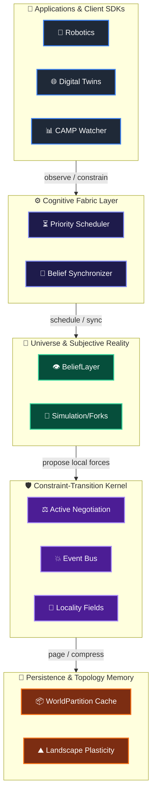
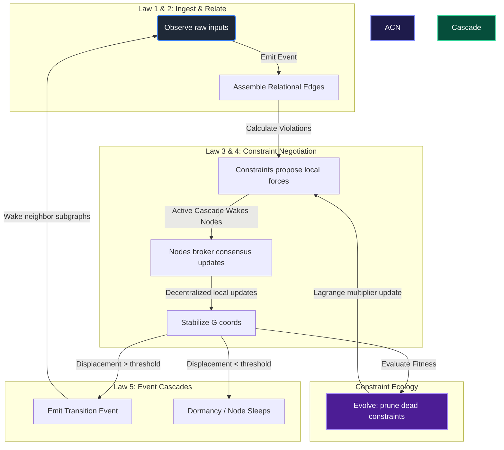

```
    ___         __  __                   
   /   |  ___  / /_/ /_  ___  __________ 
  / /| | / _ \/ __/ __ \/ _ \/ ___/ ___/ 
 / ___ |/  __/ /_/ / / /  __/ /  (__  )  
/_/  |_|\___/\__/_/ /_/\___/_/  /____/   
                                         
```

# Aether: A Physics of Computation Substrate for Stateful Intelligence

> **Aether (RealityOS) is not another AI model. It is a first-principles, Constraint-Native Runtime designed to compute and maintain evolving reality instead of running stateless, isolated operations.**
>
> *Note: The underlying codebase modules remain located in the `RealityOS/` folder, representing the core kernel of the Aether platform.*

---

## 🌌 1. The Core Concept

Computers today process information. They don't maintain reality. Every existing computational architecture—from Transformers and RNNs to databases and autonomous agents—is fundamentally stateless between execution cycles, treating computation as discrete functions ($f(x) \rightarrow y$) re-evaluated from scratch. 

Aether replaces this with a continuous, constraint-governed state trajectory.

| Traditional Computing | Aether (State Computing) |
| :--- | :--- |
| ❌ Stateless execution cycles |  Continuous, persistent state trajectory |
| ❌ Ad-hoc, lossy serialization/persistence |  First-class preservation of state over time |
| ❌ Passive reaction to inputs |  Active constraint optimization preventing drift |
| ❌ Polling/ticks-based recomputation |  Event-driven cascades (quiet regions sleep) |

### 📊 The Spreadsheet Analogy
*   In **Excel**, you write a cell formula: `C1 = A1 + B1`. If you change `A1`, Excel automatically re-calculates `C1` to satisfy the formula.
*   **Aether does this for active software and hardware systems**: You define coordinate states and constraints. When coordinates drift due to goal forces or sensor inputs, the engine automatically calculates correction forces to satisfy constraints, guaranteeing invariants and filtering out transient noise spikes.

---

## ⚖️ 2. Philosophy: The Five Primitive Laws

Aether's entire runtime emerges recursively from five primitive laws:

> [!TIP]
> ### 💥 Law 1: Everything is an Event
> Every change, observation, birth, motion, or decay is a discrete Event. Objects and states are not primary; events are.

> [!TIP]
> ### 🔗 Law 2: Events create Relationships
> Interactions establish directed topological edges. If Event $A$ repeatedly precedes Event $B$, or if they influence one another, Aether records a Relational Edge. Topology is fundamental; coordinates are merely an embedding.

> [!TIP]
> ### 🧬 Law 3: Relationships become Constraints
> Constraints are not hardcoded. When a topological relationship remains invariant over repeated event sequences, it graduates into an active, executable **Constraint Process** (an organism with its own genome, energy, trust, and mutation rate).

> [!TIP]
> ### 📉 Law 4: Constraints bend State
> State coordinates are not static; they represent the local mathematical equilibrium (saddle point) produced by constraint pressures pulling on the manifold.

> [!TIP]
> ### ⚡ Law 5: State creates new Events
> As coordinate states adjust to satisfy constraints, their displacements exceed local surprise thresholds, triggering new events that propagate outward in cascades, closing the loop.

---

## 🧭 3. The Aether Axioms

These mathematical principles govern all coordinate transitions in the Aether environment:

> [!IMPORTANT]
> **Axiom of Conservation of Intention**  
> Coordinates $G$ do not displace without a driving goal force or a constraint gradient pull. If surprise is zero, the system rests.

> [!IMPORTANT]
> **Axiom of Shadow Pricing of Stress**  
> KKT dual variables ($\Lambda$) represent the informational stress of system boundaries. Stress propagates dynamically through constraint connections.

> [!IMPORTANT]
> **Axiom of Relational Locality**  
> The local timeline step ($dt$) is computed from displacement. Redundant calculations are frozen where states are stable, guaranteeing $O(k)$ sparse scaling.

---

## 🌡️ 4. Computational Thermodynamics

Aether schedules computations by treating CPU resources as a thermodynamic heat sink, maintaining conservation rules:

$$\mathcal{M} = \frac{\Delta \mathcal{I}}{\Delta \mathcal{E}}$$

*   **⚡ Computational Energy ($\mathcal{E}$)**: Consumed by solving updates (floating-point operations).
*   **📡 Shannon Information Gain ($\mathcal{I}$)**: Produced by observations (log-reduction of uncertainty).
*   **🔋 Potential Energy ($\mathcal{U}$)**: Stored in constraint pressures ($\Lambda$).
*   **🌀 System Entropy ($\mathcal{H}$)**: The conflict rate of active constraints ($-\sum p \log p$).

The kernel schedules updates only where metabolic efficiency ($\mathcal{M}$) is maximized. Quiet regions of the graph run out of surprise and sleep, conserving energy.

---

## 🏗️ 5. System Architecture & Visual Flow

Aether is organized as a decoupled hierarchical stack, separating subjective representation, local coordinate optimization, and memory cache paging:



### 🔁 The Localized Cascade Loop
The core kernel translates events into state stabilization through a localized, event-driven cascade loop:



#### Core Module Breakdown:
*   **Fabric Layer ([RealityOS/fabric/](file:///c:/Users/namir/Downloads/project%20r/project-R/RealityOS/fabric/))**: Schedules computations based on task energy budgets (`PriorityScheduler`) and merges divergent multi-agent observations (`BeliefSynchronizer`).
*   **Universe Layer ([RealityOS/universe/](file:///c:/Users/namir/Downloads/project%20r/project-R/RealityOS/universe/))**: Manages subjective agent belief states (`BeliefLayer`) and branch projections (`SimulationLayer`).
*   **Kernel Layer ([RealityOS/kernel/](file:///c:/Users/namir/Downloads/project%20r/project-R/RealityOS/kernel/))**: Solves coordinate transitions via local force consensus (`relational_engine.py`), proposes/retires constraints (`ace_engine.py`), and routes updates within compact fields (`locality_field.py`).
*   **Memory Layer ([RealityOS/memory/](file:///c:/Users/namir/Downloads/project%20r/project-R/RealityOS/memory/))**: Compresses trajectory paths into topological attractors (`reality_compression.py`) and manages rollback history.

---

## 🛠️ 6. Unified API Primitives

Aether exposes a minimal, Unix-style set of orthogonal primitives to develop constraint-native applications:

### 6.1 High-Level Developer SDK (sdk.py)
Used for orchestrating state objects under KKT constraints.

| Method / API | Scope | Return | Description |
| :--- | :--- | :--- | :--- |
| `create_state(name, dim)` | `Universe` | `State` | Instantiates and registers a new state object. |
| `apply_constraint(name, fn)` | `Universe` | `None` | Registers a mathematical boundary function. |
| `step(dt)` | `Universe` | `None` | Steps the KKT constraint solver timeline. |
| `simulate(steps, dt)` | `Universe` | `Trajectory` | Projects future trajectories on a branched timeline. |
| `fork()` | `Universe` | `Universe` | Clones the universe to test counterfactual scenarios. |
| `merge(other)` | `Universe` | `Universe` | Composes two universes and merges their constraints. |
| `rewind(ticks)` | `Universe` | `None` | Rolls back the coordinates to a historical timeline step. |
| `replay(trajectory)` | `None` | `None` | Replays a specific sequence of coordinate frames. |
| `observe(values)` | `State` | `None` | Ingests new evidence to update active coordinates. |
| `goal(force)` | `State` | `None` | Applies an intent driving vector towards an attractor. |
| `intervene(force)` | `State` | `None` | Injects an external coordinate impulse force. |

### 6.2 Unified Aether Kernel API (aether_kernel.py)
First-principles interface implementing the 14 "Unix Moment" primitives.

| Primitive | Action | Input | Description |
| :--- | :--- | :--- | :--- |
| `observe(node, values)` | Ingest | `node_idx, List[float]` | Ingests sensory evidence event; wakes up coordinate. |
| `relate(a, b)` | Correlate | `idx_a, idx_b` | Establishes directed topological precedence/relationship. |
| `discover(threshold)` | Hypothesize | `float` | Compiles stable relations into active constraints. |
| `constrain(name, fn)` | Restrict | `name, Callable` | Injects an active constraint process (organism). |
| `stabilize(dt)` | Optimize | `float` | Runs decentralized local constraint negotiation. |
| `predict(steps, dt)` | Project | `int, float` | Projects forward trajectories along velocity vectors. |
| `simulate(steps, dt)` | Counterfactual| `int, float` | Projects simulations in parallel branched universes. |
| `fork()` | Branch | `None` | Deep clones state, relationships, and constraints. |
| `merge(other)` | Integrate | `Universe` | Fuses two universes and shifts constraint indices. |
| `rollback(ticks)` | Time-Travel | `int` | Rewinds coordinate history to previous event frames. |
| `forget(rate)` | Decay | `float` | Decays the trust (multiplier pressure) of active constraints. |
| `compress(threshold)` | Generalize | `float` | Compresses historical logs into macro bounding box rules. |
| `evolve(dt)` | Mutate | `float` | Steps constraint parameters, fitness, and prunes dead rules. |
| `measure()` | Thermodynamics | `None` | Queries potential energy, entropy, and metabolism efficiency. |

---

## 🚀 7. Code Quickstarts

### Quickstart A: High-Level SDK Orchestration
Shows coordinate stabilization and counterfactual simulation for drone tethering:

```python
from RealityOS import State, Universe

# 1. Initialize the state space (Universe)
universe = Universe(eta=0.08, alpha_dual=0.1)

# 2. Create state objects
drone_1 = universe.create_state(name="drone_1", dim=2)
drone_2 = universe.create_state(name="drone_2", dim=2)

drone_1.coords = [0.0, 0.0]
drone_2.coords = [2.0, 0.0]
universe.initialize()

# 3. Apply a continuous tether constraint (distance limit = 2.5)
def tether_constraint(G):
    import math
    dist = math.sqrt((G[0][0] - G[1][0])**2 + (G[0][1] - G[1][1])**2)
    return dist - 2.5

universe.apply_constraint("tether", tether_constraint)

# 4. Apply intent goals and step the timeline
drone_2.goal([1.0, 0.0])  # Push drone_2 in +X direction
universe.step()

# 5. Introspection & Counterfactual Simulation
# Predict future coordinates on a branched timeline without affecting active states
future_trajectory = universe.simulate(steps=5)

# 6. Time-travel rollback & counterfactual intervention
universe.rewind(ticks=1)  # Rollback 1 step in history
drone_1.intervene([-0.5, 0.5])  # Inject external impulse force
```

### Quickstart B: Law-Based Aether Kernel
Demonstrates the five primitive laws and thermodynamic measurement:

```python
from RealityOS.kernel.aether_kernel import AetherUniverse

# 1. Setup a 3-node universe
universe = AetherUniverse(size=3, dim=2, eta=0.08, alpha_dual=0.05)

# 2. Observe sensor events (Law 1) and Relate nodes (Law 2)
universe.observe(0, [0.0, 0.0])
universe.observe(1, [2.0, 0.0])
universe.observe(2, [0.0, 1.5])
universe.relate(0, 1)
universe.relate(0, 2)

# 3. Simulate history and Discover constraints (Law 3)
universe.trajectory_history = [
    [[0.0, 0.0], [2.0, 0.0], [0.0, 1.5]],
    [[0.05, -0.05], [2.05, -0.05], [0.05, 1.45]],
    [[-0.05, 0.05], [1.95, 0.05], [-0.05, 1.55]]
]
universe.discover(threshold=0.01)  # Automatically compiles & registers dist invariants

# 4. Perturb and Stabilize via local negotiation (Law 4 & 5)
universe.observe(1, [2.5, 0.0])  # Stretch tether to 2.5
universe.stabilize(dt=0.1)       # Coordinates bend to satisfy distance = 2.0

# 5. Measure thermodynamic properties
metrics = universe.measure()
print(f"Constraint Entropy:    {metrics['entropy']:.4f}")
print(f"System Potential:      {metrics['potential_energy']:.4f}")
print(f"Metabolic Efficiency:  {metrics['metabolism']:.4f}")
```

---

## 🎯 8. The Strategic Roadmap

Aether's development is organized into three phases of increasing scale and impact:

### Phase 1: Prove the Kernel (Months 0–12)
*   **Goal**: Establish core runtime proving constraint-governed state evolution and autonomous rule discovery.
*   **Key Capabilities**: Localized Active Constraint Negotiation (ACN), event-driven cascades (sleep/wake cycles), and constraint compilers.
*   **Success Metric**: Stability of coordinate representations over long step counts and clear benchmark updates reduction.

### Phase 2: Make It a Platform (Months 12–24)
*   **Goal**: Open the Aether runtime to external application developers through stable interfaces and high-level tooling.
*   **Key Capabilities**: A Constraint Compiler/parser, developer-facing debugging toolings, and domain-specific SDKs (e.g., CAMP Observability).
*   **Success Metric**: Creation of constraint-native applications without requiring internal solver knowledge.

### Phase 3: Build the Ecosystem (Months 24+)
*   **Goal**: Scale from a single engine to a collaborative community and plug-and-play solver marketplace.
*   **Key Capabilities**: Solver plugins (ADMM, Gradient Descent, KKT), open benchmark suites, and production pilots in industrial settings.
*   **Success Metric**: Community-led library extensions and native integrations.

---

## 📦 9. Installation & Execution

### 9.1 Local Installation (Development Mode)
We recommend installing in editable mode during development so any changes to the core kernel or SDK are instantly available:

```bash
# Navigate to project root
cd project-R

# Install the package in editable/developer mode
pip install -e .
```
Alternatively, build the source distributions and wheels locally:
```bash
python build_package.py
```

### 9.2 Running the Demos & Benchmarks

#### 1. Run the Developer SDK Demo
Demonstrates forks, simulations, interventions, rewinds, and replays:
```bash
python -m RealityOS.demos.demo_state_computing
```

#### 2. Run the ACN vs KKT Comparative Solver Benchmark
Compares computation updates count and localized cascades between Centralized KKT and Decentralized ACN:
```bash
python -m RealityOS.demos.benchmark_acn_vs_kkt
```

#### 3. Run the Observatory Alert Simulator (CAMP)
Compares naive threshold alerts against CAMP's belief momentum under noisy traffic:
```bash
python -m camp.demo.simulate_agents
```

#### 4. Start the Observatory Dashboard & API Server
Start the FastAPI server:
```bash
python -m camp.api.server
```
Open your browser and navigate to the live dashboard:
👉 **[http://127.0.0.1:8000/dashboard/index.html](http://127.0.0.1:8000/dashboard/index.html)**

### 9.3 Run Unit Tests
The automated test suite validates core tracking, KKT convergence, the ACE evolutionary loop, decentralized ACN sleep gates, and the 14 API primitives.

```bash
# Run all unit tests
python -m unittest discover -s camp/tests -p "test_*.py" -v
```

---
*Aether — The substrate for continuous, self-organizing systems.*
